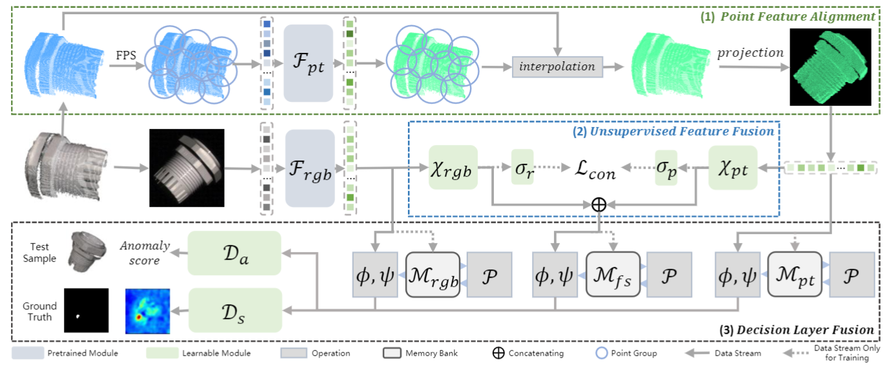

# Multimodal Industrial Anomaly Detection via Hybrid Fusion (CVPR 2023)

## Abstract
2D-based Industrial Anomaly Detection has been widely discussed, however, multimodal industrial anomaly detection based on 3D point clouds and RGB images still has many untouched fields. Existing multimodal industrial anomaly detection methods directly concatenate the multimodal features, which leads to a strong disturbance between features and harms the detection performance. In this paper, we propose {\bf \textit{Multi-3D-Memory}} ({\bf\textit{M3DM}}), a novel multimodal anomaly detection method with hybrid fusion scheme: firstly, we design an unsupervised feature fusion with patch-wise contrastive learning to encourage the interaction of different modal features; secondly, we use a decision layer fusion with multiple memory banks to avoid loss of information and additional novelty classifiers to make the final decision. We further propose a point feature alignment operation to better align the point cloud and RGB features. Extensive experiments show that our multimodal industrial anomaly detection model outperforms the state-of-the-art (SOTA) methods on both detection and segmentation precision on  MVTec-3D AD dataset.


- `The pipeline of  Multi-3D-Memory (M3DM).` Our M3DM contains three important parts: (1) **Point Feature Alignment** (PFA) converts Point Group features to plane features with interpolation and project operation, $\text{FPS}$ is the farthest point sampling and $\mathcal{F_{pt}}$ is a pretrained Point Transformer; (2) **Unsupervised Feature Fusion** (UFF) fuses point feature and image feature together with a patch-wise contrastive loss $\mathcal{L_{con}}$, where $\mathcal{F_{rgb}}$ is a Vision Transformer, $\chi_{rgb},\chi_{pt}$ are MLP layers and $\sigma_r, \sigma_p$ are single fully connected layers; (3) **Decision Layer Fusion** (DLF) combines multimodal information with multiple memory banks and makes the final decision with 2 learnable modules $\mathcal D_a, \mathcal{D_s}$ for anomaly detection and segmentation, where $\mathcal{M_{rgb}}$, $\mathcal{M_{fs}}$, $\mathcal{M_{pt}}$ are memory banks, $\phi, \psi$ are score function for single memory bank detection and segmentation, and  $\mathcal{P}$ is the memory bank building algorithm.

### [Paper](https://arxiv.org/pdf/2303.00601.pdf)

## Setup

We implement this repo with the following environment:
- Ubuntu 18.04
- Python 3.8
- Pytorch 1.9.0
- CUDA 11.3

Install the other package via:

``` bash
pip install -r requirement.txt
# install knn_cuda
pip install --upgrade https://github.com/unlimblue/KNN_CUDA/releases/download/0.2/KNN_CUDA-0.2-py3-none-any.whl
# install pointnet2_ops_lib
pip install "git+git://github.com/erikwijmans/Pointnet2_PyTorch.git#egg=pointnet2_ops&subdirectory=pointnet2_ops_lib"
```

## Data Download and Preprocess

### Dataset

- The `MVTec-3D AD` dataset can be download from the [Official Website of MVTec-3D AD](https://www.mvtec.com/company/research/datasets/mvtec-3d-ad). 

- The `Eyecandies` dataset can be download from the [Official Website of Eyecandies](https://eyecan-ai.github.io/eyecandies/). 

After download, put the dataset in `dataset` folder.

### Datapreprocess


To run the preprocessing 
```bash
python utils/preprocessing.py datasets/mvtec3d/
```

It may take a few hours to run the preprocessing. 

### Checkpoints

The following table lists the pretrain model used in M3DM:

| Backbone          | Pretrain Method                                                                                                                                                                 |
| ----------------- | ------------------------------------------------------------------------------------------------------------------------------------------------------------------------------- |
| Point Transformer | [Point-MAE](https://drive.google.com/file/d/1-wlRIz0GM8o6BuPTJz4kTt6c_z1Gh6LX/view?usp=sharing)                                                                                       |
| Point Transformer | [Point-Bert](https://cloud.tsinghua.edu.cn/f/202b29805eea45d7be92/?dl=1)                                                                                                        |
| ViT-b/8           | [DINO](https://drive.google.com/file/d/17s6lwfxwG_nf1td6LXunL-LjRaX67iyK/view?usp=sharing)                                                                                   |
| ViT-b/8           | [Supervised ImageNet 1K](https://storage.googleapis.com/vit_models/augreg/B_8-i21k-300ep-lr_0.001-aug_medium1-wd_0.1-do_0.0-sd_0.0--imagenet2012-steps_20k-lr_0.01-res_224.npz) |
| ViT-b/8           | [Supervised ImageNet 21K](https://storage.googleapis.com/vit_models/augreg/B_8-i21k-300ep-lr_0.001-aug_medium1-wd_0.1-do_0.0-sd_0.0.npz)                                        |
| ViT-s/8           | [DINO](https://dl.fbaipublicfiles.com/dino/dino_deitsmall8_pretrain/dino_deitsmall8_pretrain.pth)                                                                               |
| UFF                | [UFF Module](https://drive.google.com/file/d/1Z2AkfPqenJEv-IdWhVdRcvVQAsJC4DxW/view?usp=sharing)                                                                               |

Put the checkpoint files in `checkpoints` folder.

## Train and Test

Train and test the double lib version and save the feature for UFF training:

```bash
mkdir -p datasets/patch_lib
python3 main.py \
--method_name DINO+Point_MAE \
--memory_bank multiple \
--rgb_backbone_name vit_base_patch8_224_dino \
--xyz_backbone_name Point_MAE \
--save_feature \
```

Train the UFF:

```bash
OMP_NUM_THREADS=1 python3 -m torch.distributed.launch --nproc_per_node=1 fusion_pretrain.py    \
--accum_iter 16 \
--lr 0.003 \
--batch_size 16 \
--data_path datasets/patch_lib \
--output_dir checkpoints \
```

Train and test the full setting with the following command:

```bash
python3 main.py \
--method_name DINO+Point_MAE+Fusion \
--use_uff \
--memory_bank multiple \
--rgb_backbone_name vit_base_patch8_224_dino \
--xyz_backbone_name Point_MAE \
--fusion_module_path checkpoints/{FUSION_CHECKPOINT}.pth \
```

Note: if you set `--method_name DINO` or `--method_name Point_MAE`, set `--memory_bank single` at the same time. 


If you find this repository useful for your research, please use the following.

```bibtex
@inproceedings{wang2023multimodal,
  title={Multimodal Industrial Anomaly Detection via Hybrid Fusion},
  author={Wang, Yue and Peng, Jinlong and Zhang, Jiangning and Yi, Ran and Wang, Yabiao and Wang, Chengjie},
  booktitle={Proceedings of the IEEE/CVF Conference on Computer Vision and Pattern Recognition},
  pages={8032--8041},
  year={2023}
}
```

## Thanks

Our repo is built on [3D-ADS](https://github.com/eliahuhorwitz/3D-ADS) and [MoCo-v3](https://github.com/facebookresearch/moco-v3), thanks their extraordinary works!
